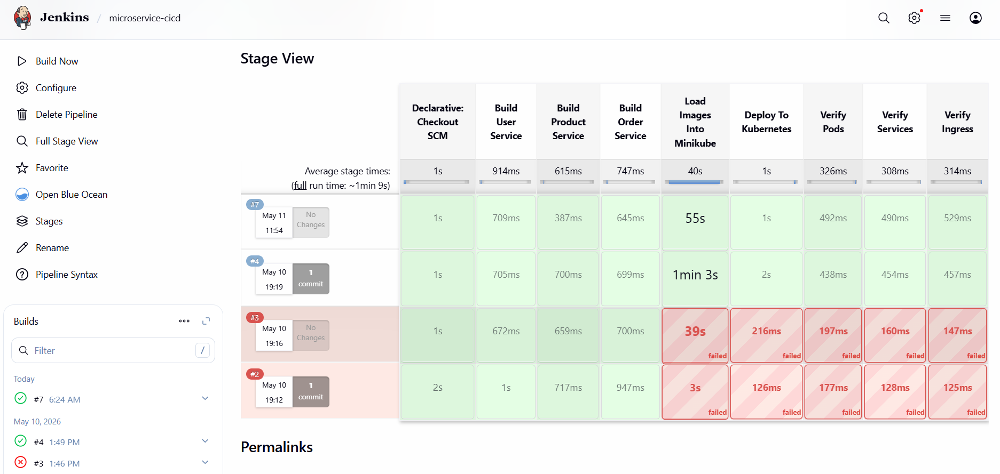
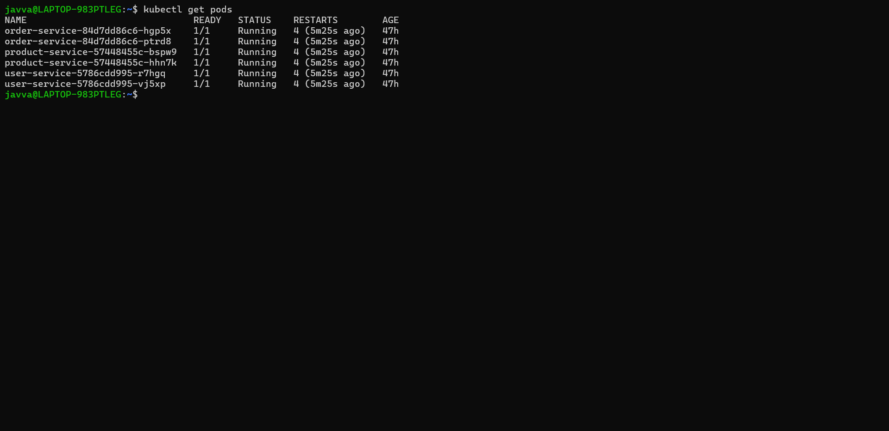
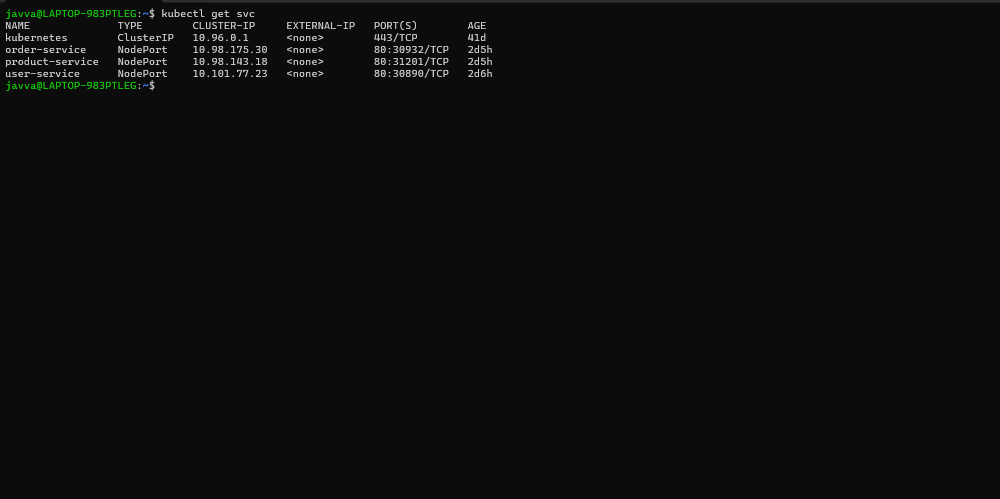
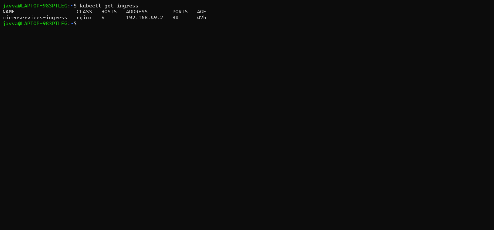
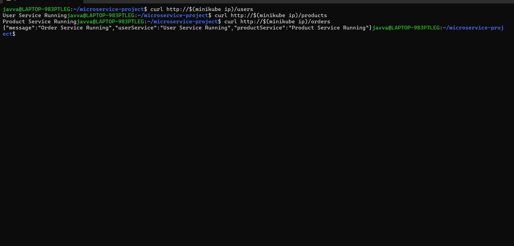
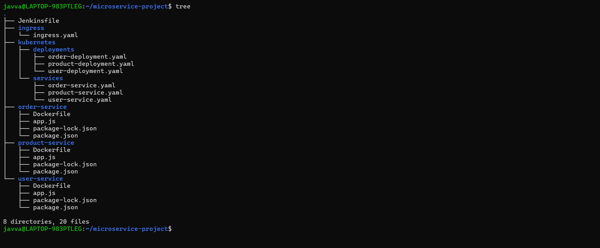

# 🚀 Three-Tier Microservices Deployment on Kubernetes with Jenkins CI/CD


---

# 📘 Project Overview

This project demonstrates a complete end-to-end DevOps workflow for deploying and managing containerized microservices using Kubernetes and Jenkins CI/CD automation.

The application consists of multiple Node.js-based microservices containerized with Docker and deployed on a Kubernetes cluster running on Minikube. An NGINX Ingress Controller is used for traffic routing, while Jenkins automates the build and deployment pipeline.

The project simulates a real-world DevOps environment by integrating:

- ✅ Microservices architecture
- ✅ Docker containerization
- ✅ Kubernetes orchestration
- ✅ Jenkins CI/CD automation
- ✅ Ingress-based routing
- ✅ Infrastructure as Code using YAML manifests

---

# 🏗️ Architecture

```text
Developer
    ↓
GitHub Repository
    ↓
Jenkins CI/CD Pipeline
    ↓
Docker Image Build
    ↓
Minikube Kubernetes Cluster
    ↓
NGINX Ingress Controller
    ↓
Microservices
```

---

# ⚙️ Tech Stack

| Technology | Purpose |
|---|---|
| Docker | Containerization |
| Kubernetes | Container orchestration |
| Jenkins | CI/CD automation |
| Minikube | Local Kubernetes cluster |
| NGINX Ingress Controller | Traffic routing |
| Node.js | Backend microservices |
| Git & GitHub | Version control |
| YAML | Kubernetes configuration |

---

# 🧩 Microservices

## 👤 User Service

Handles user-related requests.

Endpoint:

```bash
/users
```

---

## 📦 Product Service

Handles product-related requests.

Endpoint:

```bash
/products
```

---

## 🛒 Order Service

Handles order-related requests.

Endpoint:

```bash
/orders
```

---

# 📂 Project Structure

```text
microservice-project/
│
├── user-service/
│   ├── app.js
│   ├── Dockerfile
│   └── package.json
│
├── product-service/
│   ├── app.js
│   ├── Dockerfile
│   └── package.json
│
├── order-service/
│   ├── app.js
│   ├── Dockerfile
│   └── package.json
│
├── kubernetes/
│   ├── deployments/
│   └── services/
│
├── ingress/
│   └── ingress.yaml
│
├── Jenkinsfile
├── README.md
└── .gitignore
```

---

# 🔄 CI/CD Pipeline Workflow

The Jenkins pipeline automates the following stages:

1. Build Docker images for all microservices
2. Load images into Minikube
3. Deploy Kubernetes manifests
4. Verify deployments and services
5. Verify ingress configuration

---

# 🚀 Pipeline Flow

```text
Build Images
    ↓
Load Images Into Minikube
    ↓
Deploy To Kubernetes
    ↓
Verify Pods
    ↓
Verify Ingress
```

---

# ☸️ Kubernetes Components Used

## 📌 Deployments

Used to manage application pods and replicas.

## 📌 Services

Used for internal communication between Kubernetes resources.

## 📌 Ingress

Used for external HTTP routing to microservices.

---

# 🌐 Ingress Routing

| Route | Service |
|---|---|
| /users | User Service |
| /products | Product Service |
| /orders | Order Service |

---

# 🛠️ Setup Instructions

## 1️⃣ Start Minikube

```bash
minikube start
```

---

## 2️⃣ Enable Ingress

```bash
minikube addons enable ingress
```

---

## 3️⃣ Deploy Kubernetes Resources

```bash
kubectl apply -f kubernetes/deployments/
kubectl apply -f kubernetes/services/
kubectl apply -f ingress/
```

---

## 4️⃣ Verify Resources

```bash
kubectl get pods
kubectl get svc
kubectl get ingress
```

---

# 🤖 Jenkins Automation

The Jenkins pipeline is configured using a declarative Jenkinsfile.

### Features

- ✅ Automated Docker builds
- ✅ Kubernetes deployment automation
- ✅ CI/CD workflow integration
- ✅ Infrastructure deployment using YAML manifests

---

# 🧪 Sample Verification

```bash
curl http://$(minikube ip)/users
curl http://$(minikube ip)/products
curl http://$(minikube ip)/orders
```

---

# 📚 Key DevOps Concepts Demonstrated

- CI/CD Pipeline Automation
- Kubernetes Orchestration
- Docker Containerization
- Infrastructure as Code
- Ingress Routing
- Microservices Architecture
- Automated Deployment Workflow

---

# 🔮 Future Enhancements

Potential future improvements:

- Helm chart integration
- Monitoring with Prometheus and Grafana
- ArgoCD GitOps deployment
- Horizontal Pod Autoscaling
- Kubernetes Secrets management
- Docker image registry integration

---

# 📸 Project Screenshots 
## Jenkins Pipeline



## Kubernetes Pods



## Kubernetes Services



## Ingress Configuration



## Application Testing



## Project Structure



---

# 👨‍💻 Author

**Rohini Javvaji**
Aspiring DevOps Engineer
- gitHub:
  https://github.com/RohiniJ1204
